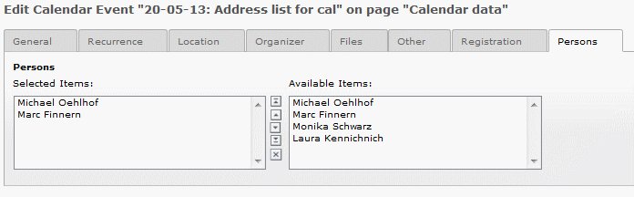

.. ==================================================
.. FOR YOUR INFORMATION
.. --------------------------------------------------
.. -*- coding: utf-8 -*- with BOM.

.. include:: ../Includes.txt

What does it do?
================

This extension adds usage of tt_address records for cal events.
Maybe your cal events are sessions which have one ore more speaker.
For this case you can add the speaker (tt_address record) to the cal event
with the use of this extension.

**Best practise from the scratch**

- Easy to use/understand for editors

**Background**

- Following the TYPO3 coding guidelines

- Documentation based on reST

Before updating to the latest version
-------------------------------------
Before updating any version of the extension to the latest one, always
check out the `release notes`_ in the wiki:

.. _release notes: http://forge.typo3.org/projects/extension-addresslist4cal/wiki/Release\_Notes

Screenshots
-----------

**Image 1:** Show settings in the cal event.

