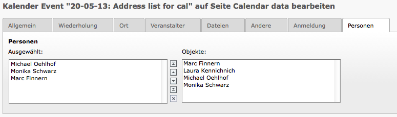

.. ==================================================
.. FOR YOUR INFORMATION
.. --------------------------------------------------
.. -*- coding: utf-8 -*- with BOM.

.. include:: ../Includes.txt

Wie funktioniert es ?
=====================

Diese Erweiterung fügt die Verwendung von Adress Datensätzen (tt_address) bei Kalender Terminen (cal events) hinzu.
Wenn Ihre Termine z.B. Vorträge mit einem oder mehreren Sprechern sind, dann können Sie den Sprecher
(tt_address Datensatz) dem Termin (cal event) mit Hilfe dieser Erweiterung hinzufügen.

**Bewährtes Verfahren von Grund auf**

- Für Redakteure einfach zu benutzen/verwenden

**Hintergrund**

- Folgt den TYPO3 coding guidelines

- Dokumentation basiert auf reST

Bevor Sie auf die neueste Version aktualisieren
-----------------------------------------------
Bevor Sie von irgendeiner Version auf die neueste aktualisieren, werfen Sie immer zuerst einen Blick
in die `Release Notes`_ im Wiki:

.. _Release Notes: http://forge.typo3.org/projects/extension-addresslist4cal/wiki/Release\_Notes

Screenshots
-----------

**Bild 1:** Anzeige der Einstellungen im Kalendertermin.

